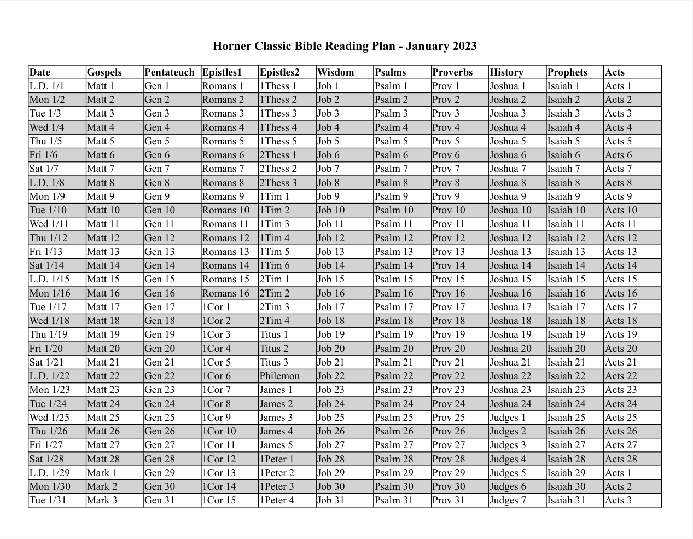

# Professor Horner's Intensive Bible Reading Plan

[Professor Grant Horner](https://www.masters.edu/faculty_staff_bio/grant-horner/) at the Master's Seminary created a Bible reading plan in which you read 1 chapter each day from 10 different categories of books of the Bible:
1. Gospels: Matthew, Mark, Luke, John
2. Pentateuch: Genesis, Exodus, Leviticus, Numbers, Deuteronomy
3. Epistles1: Romans, 1 Corinthians, 2 Corinthians, Galatians, Ephesians, Philippians, Colossians, Hebrews
4. Epistles2: 1 Thessalonians, 2 Thessalonians, 1 Timothy, 2 Timothy, Titus, Philemon, James, 1 Peter, 2 Peter, 1 John, 2 John, 3 John, Jude, Revelation
5. Wisdom: Job, Ecclesiastes, Song of Songs
6. Psalms: Psalms
7. Proverbs: Proverbs
8. History: Joshua, Judges, Ruth, 1 Samuel, 2 Samuel, 1 Kings, 2 Kings, 1 Chronicles, 2 Chronicles, Ezra, Nehemiah, Esther
9. Prophets: Isaiah, Jeremiah, Lamentations, Ezekiel, Daniel, Hosea, Joel, Amos, Obadiah, Jonah, Micah, Nahum, Habakkuk, Zephaniah, Haggai, Zechariah, Malachi
10. Acts: Acts


Here is a [freely downloadable/printable PDF](HornerClassicBibleReadingPlanFor2023.pdf?raw=true) listing 1 year of readings, starting on January 1, 2023. Each month starts on a new page. To make it easier to follow the readings for each day, the readings for every other day are shaded in light gray:<br><br>



In the PDF, for Bible book abbreviations:
- I often used the "Most common" abbreviation from Logos Software's
[Bible Book Abbreviations](https://www.logos.com/bible-book-abbreviations).
- But if there was a longer (but 6-character or less) one there, I sometimes used that instead.
- And for 1-chapter Bible books, I replaced the abbreviated book name and chapter number with just the unabbreviated book name. An exception is that I used the abbreviations "2John" and "3John" to be consistent with that of "1John".

Some additional resources for the Bible reading plan are: 
- the YouVersion Bible app's page for [automatically using the plan with YouVersion](https://www.bible.com/en-GB/reading-plans/19)
- [downloadable/printable bookmarks](https://eastwhiteoak.church/wp-content/uploads/2022/12/Professor-Horner-Reading-Plan-Bookmarks.pdf) for each of the 10 different categories in the plan

## Setup Instructions

If you wish to re-create the plan from scratch using Python, here are some high-level instructions:

1. Download Python from [python.org](https://www.python.org/downloads/), and install it on your computer

2. Clone (or download) this GitHub repository to a folder on your computer

3. On your computer, set your working directory to the folder where you cloned this repository

4. Optionally: Create and activate a Python virtual environment in that folder, as in:
```
python -m venv .venv
```
[to keep the Python 'PrettyTable' (installed below) separate from your main Python installation]

5. Within the same folder, install this repository's dependencies, by typing:
```
   pip install -r requirements.txt
```
That installs the [PrettyTable](https://pypi.org/project/prettytable/) Python package (listed in requirements.txt), along with its dependencies.

6. Using Python, run the create_plan.py file:

- Currently, that just creates a simple HTML file containing just the HTML code for the table of readings.
- I manually, split that into separate tables for each of the 12 months, and formatted the tables so they print 1 per page, with every even-numbered row shaded in light gray.
- I plan to replicate that programatically (in Python) in the future.

7. Open the PDF file in a Web browser, and print the Web page to a PDF file